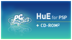

          HuE for PSP 0.70 by E (T.Kawamorita)
## Screenshot

## Change Log

(1) Sprite Priority bugfix
    (A) Y's 1 & 2
    (B) F1 Circus 92

(2) SuperGrafx support (incomplete)

Change (3) the state is saved
    Data so far can not be used.
    Save format there may be a change in the future is greater.

<Have not been able to>
Speed ​​of games that use an interrupt (a) raster
    Postponed because of a problem I thought and was able to speed up.

<Schedule>
Related fixes (1) Sound
Implementation of improvement (2) CDROM, save state support

-------------------------------------------------- -----------------------------
<Acknowledgements>
Has let me use a length of 10 as (1) font.
Was used as the reference software for a variety of sources (2) PSP.
    I do not remember what I was referring to the various reference too (-;
    Thanks to all the people who who exposes the soft!
Mr. (3) Ruka, we had to speed up the CPU core. Thanks!
I referred to by Mr uoSnes9x how to use the GPU (4) y. Thanks!
I referred a variety of documents (5). Thanks to those who will create a document!

-------------------------------------------------- -----------------------------
<Reference>
(Http://cgfm2.emuviews.com/) Mr. (1) Charles MacDonald
    sgxtech.txt
    pcetech.txt
    The implementation is sgxtech.txt SuperGrafx was particularly useful.

(Http://www.geocities.jp/team_zero_three/PC2E/index.html) Mr. (2) PC2E Ki
    Used to check whether the results are correct emulation
    Was performed with reference to various implementations PC2E source code.
    Helped to fix a bug in the (A) SATB DMA.
    Helped fix (B) sprite priority.

(3) HuGo source code
    Helped to fix a bug in the (A) SATB DMA.
    Helped fix (B) sprite priority.

Source of (4) fpce / xpce / HuE
    PCEngine Emulator is great it was based.
    Started from here!

(5) YAME 0.38
    Used to check whether the results are correct emulation

(6) PCEP 0.70
    I was allowed to use the implementation for the CDROM emulation.

PCEngine Emulator and Source (7) Other
